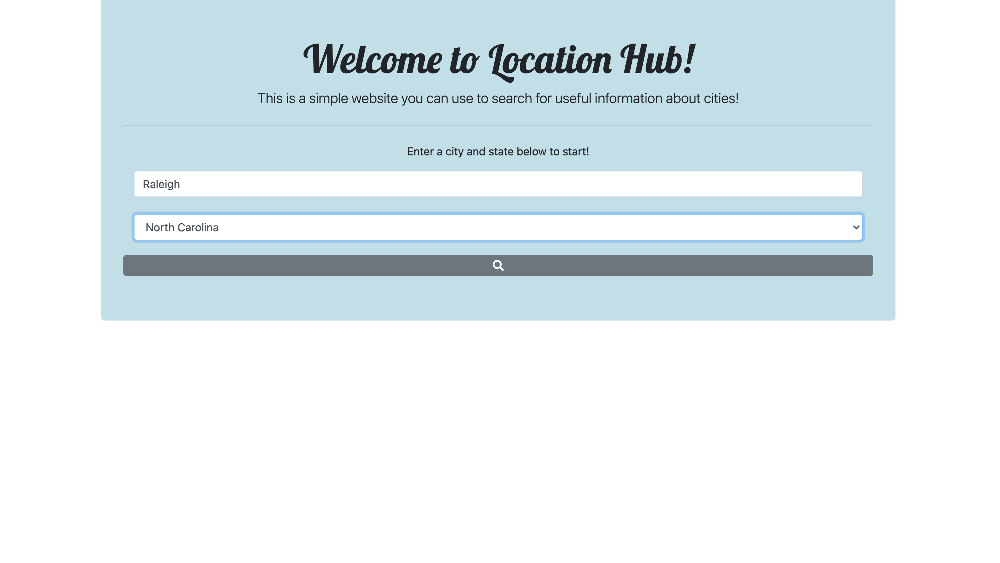
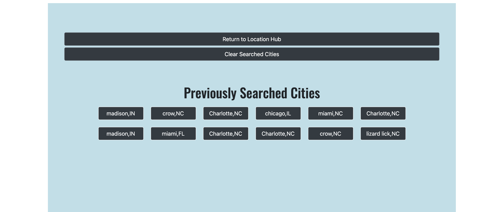

# project1-team4

Welcome to The Location Hub!

  Are you travelling or a new resident, and want to know what the weather is like  for the city and  what the covid stats are for the states, in order to see if it is safe to go to a local restaurant? Well then.. you are in the right site!

How to:
1. Enter desired city or town.
2. Select desired state.
3. Click the search button.
4. Your desired stat's should pop up from Weather on the left, The states Covid stats on the right, and three local restaurant's at the bottom.

-> If you are curious about past searches on the bottom container of the site:
1. click desired city/state.
2. stats for that city/state should pop-up.

-> If there are too many previous search buttons or want to clear:
1. click the "Clear Searched Cities" button.

->If you want to do a search again and/or got back to home screen:
1. Click the "Return to Location Hub" button.

